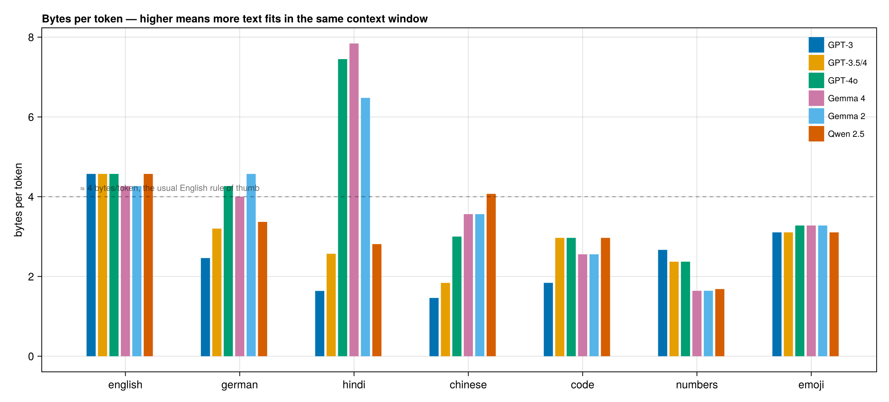
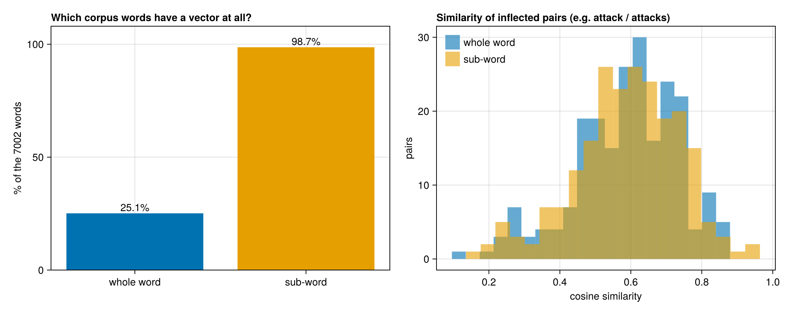

# Tokenizer experiments

[`tokenize`](@ref) in this package is the simplest thing that works: lowercase,
letters only, split at full stops. Real models use reversible sub-word
tokenizers. The scripts in `experiments/` download the real ones — only the
tokenizer files, a few MB, never the model weights — and measure the
difference.

```
pip install tiktoken tokenizers huggingface_hub
python experiments/tokenizer_zoo.py
julia --project=docs experiments/tokenizer_plots.jl
```

## How the same text is cut up

Tokens needed for the same sentence in several languages:

| text | GPT-3 | GPT-3.5/4 | GPT-4o | Gemma 4 | Qwen 2.5 |
|---|---|---|---|---|---|
| english | 14 | 14 | 14 | 15 | 14 |
| german | 26 | 20 | 15 | 16 | 19 |
| hindi | **91** | 58 | 20 | **19** | 53 |
| chinese | 39 | 31 | 19 | 16 | 14 |
| code | 50 | 31 | 31 | 36 | 31 |
| numbers | 24 | 27 | 27 | **39** | 38 |

The same Hindi sentence costs 91 tokens on GPT-3 and 19 on Gemma 4 — a 4.8×
difference in price and context for identical content, while English is 14
everywhere. Gemma spends more on numbers because it splits every digit:
`2026` → `2 0 2 6`, which keeps arithmetic uniform at the cost of length.



Other things the probes show: every real tokenizer round-trips exactly
(`decode(encode(x)) == x`, 7/7), unknown characters fall back to UTF-8 bytes
rather than an unknown token, and runs of spaces survive — which is why the
code sample costs GPT-3 50 tokens and everyone else about 31.

## Does the tokenizer change the vectors?

`experiments/tokenize_corpus.py` tokenizes one corpus two ways — whole words,
and Gemma 4 sub-word pieces — and `experiments/subword_vs_word.jl` trains the
same model on each. Both streams are lowercased, so the only variable is the
unit.

On the Lee news corpus (60k words):

| | whole word | sub-word |
|---|---|---|
| vocabulary kept | 1,759 words (min\_count 5) | 8,062 pieces |
| tokens produced | 60,302 | 75,914 (1.26×) |
| corpus words with a vector | **25.1%** | **98.7%** |
| of the 5,243 rare words | 0% | **98.3%** |

Three quarters of the word *types* in the corpus occur fewer than five times.
The whole-word model discards all of them; the sub-word model composes them
from pieces it knows. That coverage gap is the real payoff — not better
vectors for common words.



Morphology, the usual argument for sub-words, barely moves here:

```
219 inflected pairs found (act/acting, action/actions, airline/airlines, …)
they share a piece in 3 of them (1%)
mean similarity, whole-word   +0.588
mean similarity, sub-word     +0.590
```

Gemma's vocabulary is so large that 81% of these words are a single piece —
`attacks` is one token, not `attack`+`s` — so there is nothing to share.
Sub-word units help morphology only when the vocabulary is small enough to
force splits.

And pooling pieces has a failure mode worth seeing:

```
commandos  ▁command+os   -> command (0.95), cocos (0.93), palos (0.87)
gilchrist  ▁gil+christ   -> matthew (0.96), adam (0.96), hayden (0.92)
collins    ▁coll+ins     -> escorted (0.90), ashes (0.90), tarpaulins (0.90)
```

`gilchrist` lands among cricketers, which the corpus context earned. `collins`
lands near `tarpaulins` — pure spelling overlap through the `ins` piece.
Averaging pieces always gives you *a* vector; sometimes it is a vector of the
spelling rather than the meaning.

A note on method: the piece vocabulary is not filtered by frequency, because a
real tokenizer's vocabulary is fixed before training rather than derived from
the corpus. Apply `min_count = 5` to pieces as well and the coverage advantage
largely disappears, since a word seen twice usually has pieces seen twice.
